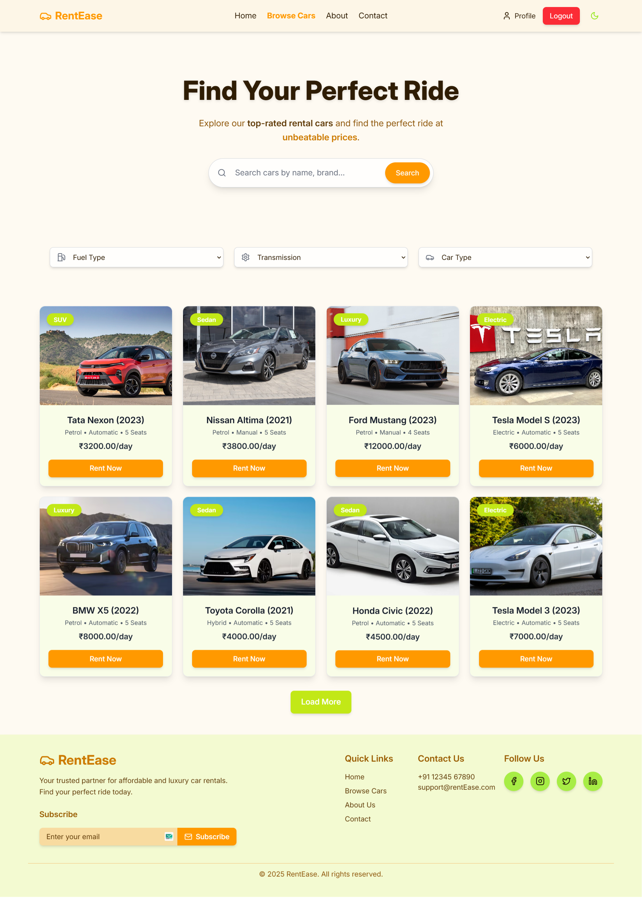

# RentEase - Car Rental System

RentEase is a full-stack car rental platform built with React, Node.js, and MySQL.  
It enables users to browse available cars, book rentals in real time, and manage bookings—all with a smooth and responsive interface.

> **Note:** This project is a demo system for learning and showcasing full-stack development. Not affiliated with any actual car rental company.

## Live Demo

[Try RentEase Live](https://rent-ease-site.vercel.app/)

## Preview Screens

  
<strong>Register Page</strong>

  

  
<strong>Login Page</strong>

  

  
<strong>Home Page</strong>

  

  
<strong>Browse Cars Page</strong>

  

  
<strong>About Page</strong>

  

  
<strong>Contact Page</strong>

  

  
<strong>Car Details Page</strong>

  

  
<strong>Booking Form Modal</strong>

  

  
<strong>Confirm Booking Modal</strong>

  

  
<strong>User Dashboard</strong>

  

  
<strong>Razorpay Payment Modal</strong>

  

  
<strong>Admin Dashboard</strong>

  

  
<strong>Admin Manage Cars</strong>

  

  
<strong>Admin Manage Bookings</strong>

  

  
<strong>Admin Manage Users</strong>

  

  
<strong>Admin Add Car</strong>

  

  
<strong>Dark Mode - Car Details</strong>

  

## Features Implemented

- Secure user and admin authentication using JWT
- Browse, search, and filter car listings with real-time availability
- Book, modify, and cancel rentals seamlessly
- Admin dashboard for managing cars, users, and bookings
- User dashboard for viewing rental history
- Integrated Razorpay for secure and smooth payment processing
- Responsive design for desktop and mobile devices

## Design Choices

- **Clean & Responsive UI:** Built with React and Tailwind CSS for a modern look
- **Robust Backend:** Node.js and Express provide a scalable API layer
- **Secure Auth:** JWT-based authentication protects user data
- **Real-time Updates:** Booking system reflects live car availability
- **Modular Code:** Organized for maintainability and easy expansion
- **Payment Integration:** Razorpay ensures safe and seamless transactions

## Technologies Used

- React (Vite), TypeScript, Tailwind CSS
- Node.js (Express), TypeScript
- MySQL Database hosted on Aiven (free tier)
- JSON Web Tokens (JWT) for authentication
- Razorpay for payment gateway
- Vercel (frontend) & Render (backend) for deployment

## License

MIT © Shubham Patil
